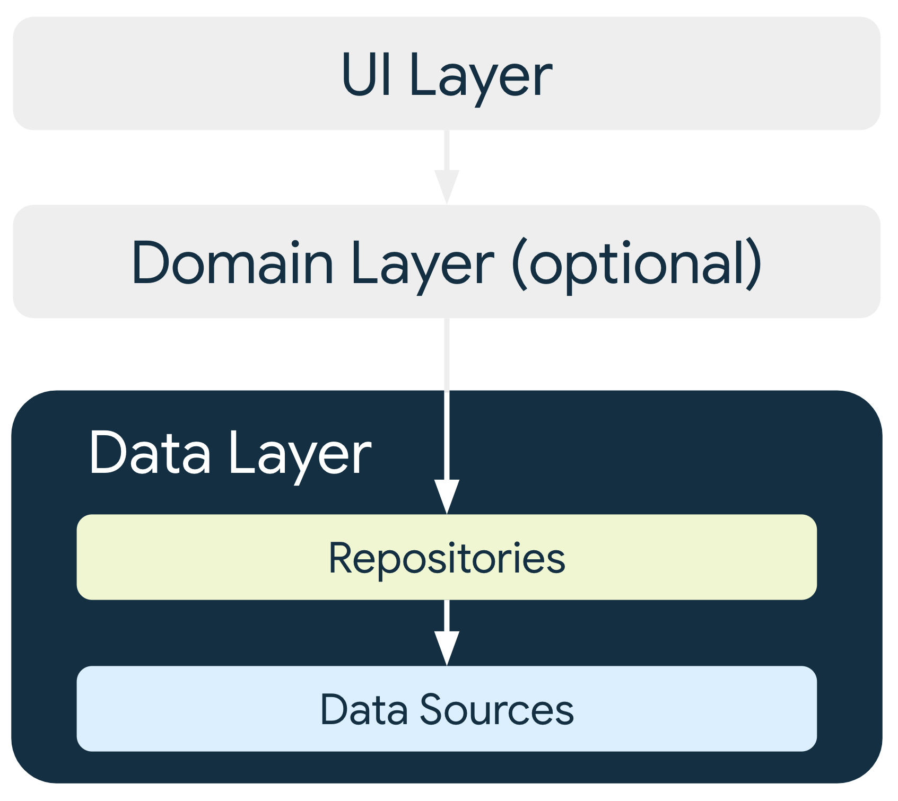

# android-dev-study

This contains all my study notes for android developer training. 

## Mobile app introduction

- typical android app contains multiple app components. E.g activities, fragments, services
- these are declared in the app manifest file
- possible for app components to be launched individually & out of order, when the OS is allocating memory for other resources
- due this this behaviour, it is not recommended to store app data or state in app components and components shouldn’t depend on each other
- 2 common principals are: Separation of concerns & Drive UI from data models
  * activity & Fragment are UI-based classes, should only contain logic handling UI and OS interactions
  * data models represent the data of an app, not tied to the UI & app component lifecycle
  * destroyed when the OS removes the app process from memory
  * persistent data models are ideal for the following reasons:
    * your users don't lose data if the Android OS destroys your app to free up resources
    * your app continues to work in cases when a network connection is flaky or not available

## Recommended app arch

* each app should have at least the following 2 layers: 
  * UI - displays data on the screen
  * Data - contains business logic & exposes app data
  * optional is the Domain layer, which simplifies interactions between UI & Data layers

### UI layer
* made up of
  * UI elements that render data on the screen (elements are built using Views)
  * state holders that hold data, expose it to the UI & handle logic 

### Data layer
* the Data layer contains the business logic, made up of rules that determines how your app creates, stores & changes data
* made up of repositories that each can contain zero to many data sources
* create a repository class for each different type of data you handle in your app
* repository classes are responsible for
  * exposing data to the app
  * centralizing changes to the data
  * resolving conflicts between multiple data sources
  * abstracting sources of data from the app
  * contain business logic

### Domain layer
* is responsible for encapsulating complex business logic, or logic that is reused by multiple ViewModels
* an optional layer that should only be used when needed, such as to handle complexity or promote reusability
* classes in this layer are commonly called cases or interactors
* each use case of this layer should have responsibility over a single functionality 

### Manage dependency between components 
* use one of these design patterns to gather the dependencies of a particular class
  * Dependency Injection (DI): allows classes to define their dependencies without constructing them. At runtime, another class is responsible for providing these dependencies
  * Service Locator: The service locator pattern provides a registry where classes can obtain their dependencies instead of constructing them.
* These patterns allow you to scale your code because they provide clear patterns for managing dependencies without duplicating code or adding complexity
